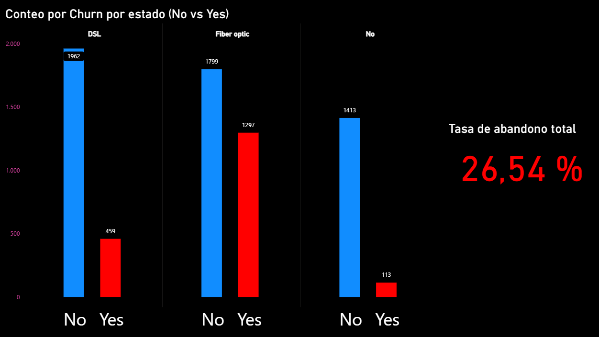
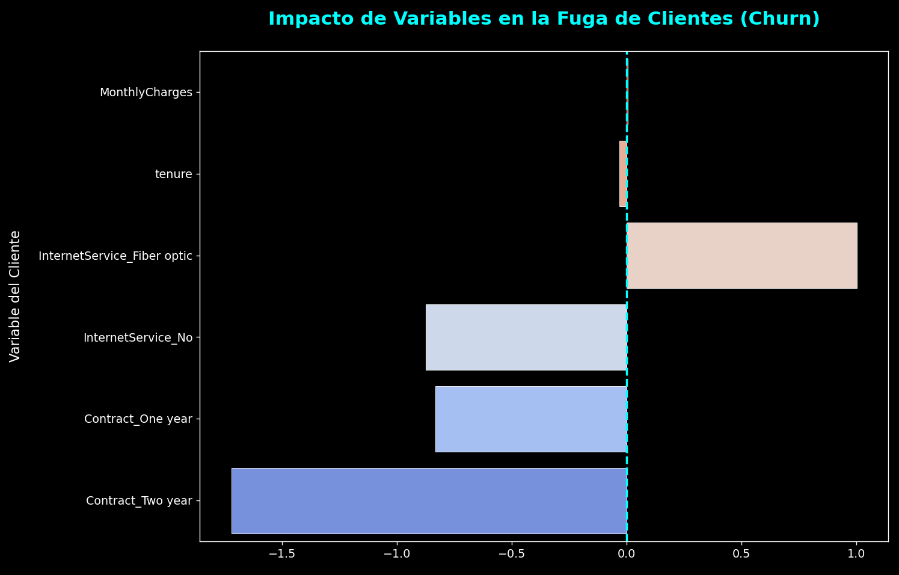

# 📊 Análisis y Predicción de Churn (Customer Retention Analytics)

---

## 🎯 Objetivo del Proyecto

Analizar los factores que influyen en la fuga de clientes (*churn*) y desarrollar un modelo predictivo que permita **anticipar abandonos y optimizar estrategias de retención**.

El proyecto integra SQL, Python y Power BI para transformar datos de clientes en decisiones de negocio.

---

## 🧠 Problema de Negocio

La retención de clientes es un factor crítico en modelos de suscripción. La organización enfrenta:

- Alta tasa de abandono de clientes  
- Falta de visibilidad sobre causas del churn  
- Dificultad para anticipar cancelaciones  

👉 Pregunta clave del análisis:

**¿Qué factores impulsan la fuga de clientes y cómo se pueden prevenir de manera proactiva?**

---

## 📊 Dashboard Interactivo

🔗 **Acceso al dashboard (Power BI):**  
_Agregar link si está publicado_

📁 **Archivo local:**  
`/Dashboard/churn-analysis.pbix`

---

## 📊 Metodología

El análisis se desarrolló en tres etapas:

### 1. Extracción y Preparación de Datos (SQL)
- Limpieza y transformación de datos de clientes  
- Construcción de variables relevantes para análisis  

### 2. Análisis Exploratorio (Power BI)
- Identificación de patrones de abandono  
- Segmentación por tipo de contrato, servicio y costo  

### 3. Modelado Predictivo (Python)
- Implementación de modelo de regresión logística  
- Evaluación de precisión y relevancia de variables  

---

## 💡 Insights Clave

- **Tipo de contrato:**  
  Los clientes con contratos mensuales presentan mayor probabilidad de churn.

- **Servicio de internet:**  
  La fibra óptica muestra tasas más altas de abandono, indicando posibles problemas de calidad o precio.

- **Cargos mensuales:**  
  Existe una relación directa entre mayor costo y mayor probabilidad de cancelación.

- **Tasa de churn:**  
  Se identificó una tasa total del **26.54%**, concentrada en segmentos específicos.

---

## 🤖 Modelo Predictivo

Se implementó un modelo de **Regresión Logística** con una precisión aproximada del **80%**, permitiendo:

- Predecir la probabilidad de abandono por cliente  
- Identificar variables más influyentes en la decisión de churn  
- Priorizar acciones de retención  

---

## 📈 Conclusión y Recomendaciones

El análisis demuestra que el churn puede gestionarse de forma proactiva mediante segmentación y modelos predictivos.

👉 Recomendaciones:

- Incentivar contratos de largo plazo para mejorar retención  
- Revisar la calidad/precio del servicio de fibra óptica  
- Diseñar estrategias de pricing y bundles para reducir abandono  
- Utilizar el modelo predictivo para priorizar clientes en riesgo  

---

## 🛠️ Stack Tecnológico

- **PostgreSQL** → Limpieza y preparación de datos  
- **Python (Pandas, Scikit-learn)** → Modelado predictivo  
- **Power BI** → Visualización y análisis exploratorio  
- **Matplotlib / Seaborn** → Visualización estadística  

---

## 📁 Estructura del Repositorio

- `/Data` → Dataset utilizado (anonimizado)  
- `/SQL` → Scripts de limpieza y transformación  
- `/Python` → Modelado y análisis predictivo  
- `/Dashboard` → Archivo Power BI  
- `/img` → Visualizaciones del proyecto  

Dataset utilizado con fines educativos.
